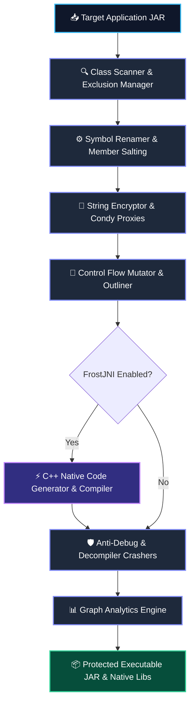
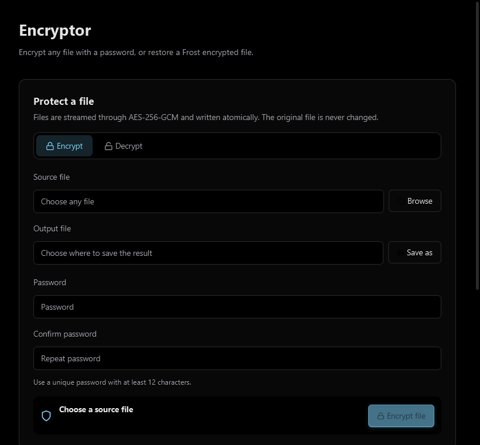
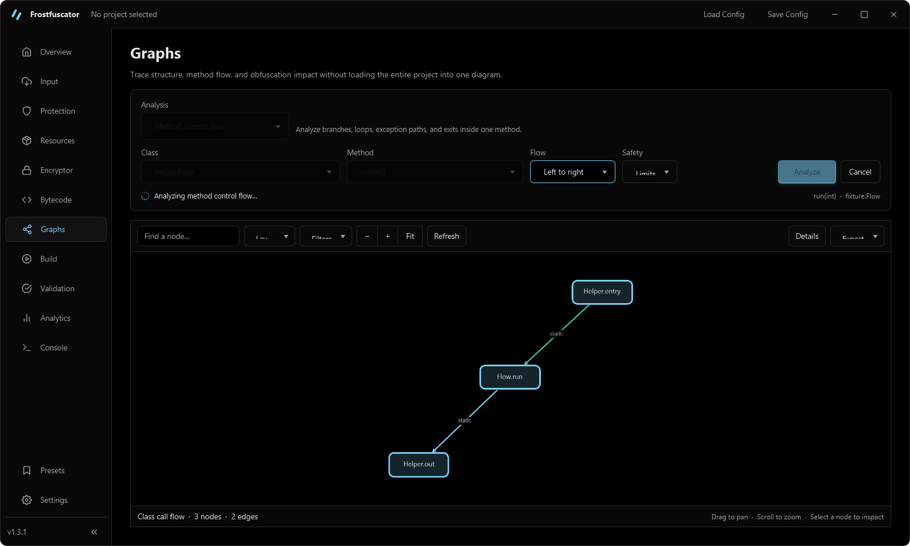

<div align="center">


**A fun & capable Java bytecode obfuscator built with ASM**

*Originally built for protecting Minecraft plugins and mods, Frostfuscator works with any Java application — featuring typed SSA-backed bytecode transformations, native FrostJNI stubs, a Raycast-inspired desktop GUI, and interactive graph analytics.*

[](https://openjdk.org/)
[](https://asm.ow2.io/)
[](docs/transformers.md)
[](build.gradle)
[](LICENSE)

---

[Quick Start](docs/index.md) • [CLI Guide](docs/cli.md) • [GUI Guide](docs/gui.md) • [Transformers](docs/transformers.md) • [Plugin API](docs/plugins.md) • [Documentation](docs/)

---

</div>

## 📌 Overview

**Frostfuscator** is a feature-packed Java bytecode obfuscator and analysis tool built on OW2 ASM. What started as a fun project for protecting Minecraft mods and plugins has grown into a solid, versatile protection suite for any JVM application (Java, Kotlin, Scala).

It combines class & member renaming, string encryption, control-flow mutation, a **verification-safe typed SSA pipeline**, **FrostJNI native stub compilation**, an **OLED dark desktop GUI**, and an **interactive graph visualizer** to make reverse-engineering much harder while staying easy to use.

> [!NOTE]
> **Requirements**: Java **21 or newer**. If you want to compile native stubs using **FrostJNI**, you'll also need a standard C/C++ compiler (`clang` or `gcc`/`mingw`) installed.

---

## ✨ Key Features

### 🛡️ Obfuscation & Protection
* **Symbol Renaming**: Rename classes, methods, fields, local variables, and method parameters with customizable dictionaries.
* **String & Constant Protection**: String encryption with inline anti-tamper stack checks, plus numeric constant mutation.
* **Control-Flow Transformations**: Opaque predicates, switch rewriting, basic-block shuffling, exception-based flow, method outlining, and instruction substitution.
* **Dynamic Proxies & References**: `ConstantDynamic` (Condy) indirection & `invokedynamic` proxies to hide reflection, field access, and method invocations.
* **Anti-Reverse Engineering**: Anti-debug checks, JavaAgent/ByteBuddy detectors, and decompiler parser crashers (targeting Jadx, CFR, Procyon, Fernflower).
* **FrostJNI Native Stubbing**: Convert selected Java methods into compiled native C++ shared libraries (`.dll`, `.so`, `.dylib`).
* **Noise & Watermarking**: Class/method salting, line-number spoofing, member stuffing, and synthetic metadata.

### 🧊 Frost-IR & Typed SSA Engine

* **Verification-Safe Transformation**: Lifts supported JVM methods into typed SSA, runs bounded transformations, reconstructs frames and exception metadata, verifies the result, and only then replaces the original bytecode.
* **Compiler-Grade Analyses**: Dominance, loops, liveness, sparse conditional constant propagation, global value numbering, symbolic expressions, MemorySSA, alias, escape, nullness, and integer-range analysis.
* **IR-Backed Protection Passes**: Optimization, control-flow, encryption, indirection, method-salting, and virtualization paths share one ownership-safe CFG and use-def model instead of editing fragile stack patterns independently.
* **Safe Fallbacks**: Unsupported or unverifiable methods keep their original ASM bytecode rather than receiving a partial rewrite.
* **Deterministic Tooling**: Stable snapshots, text and DOT output, versioned JSON/binary serialization, validation diagnostics, and plugin extension contracts support repeatable pipelines.

### 🔌 Modular Plugin API (`frost-api`)
* **Clean & Standalone**: Standalone `frost-api` module with a priority-aware `EventBus` (`PreObfuscationEvent`, `ClassTransformEvent`, `PostObfuscationEvent`).
* **Custom Extensions**: Easily create your own `PluginTransformer`, `StringEncryptorPlugin`, `NameGeneratorPlugin`, or `CustomDecompilerProvider`.
* **In-Memory Java Compiler**: IDE editing mode with `InJarJavaCompiler` and `BytecodeAssembler` for direct live patching.

### 📊 Graph Analytics & Visualizer
* **Multiple Graph Views**: Visual mapping of class dependencies, method call graphs, class inheritance, package structure, and control flow.
* **Cytoscape Desktop UI**: Interactive visual graph workspace for inspecting code relationships and build stats.
* **Headless Exports**: Export graphs directly to **Mermaid**, **JSON**, or **DOT** from the command line.

### 📦 Containers & Framework Support
* **Fat JAR Support**: Handles nested archives seamlessly (`BOOT-INF/lib/*.jar`, `WEB-INF/lib/*.jar`, `META-INF/jars/*.jar`).
* **Modding & Plugin Presets**: Native support for **Fabric Mod** (`fabric.mod.json`) parsing & Mixin remapping, plus **Spigot**, **Forge**, and **Sponge**.
* **Framework Presets**: Built-in exclusion rules for `Gson`, `Jackson`, `Spring`, `JPA`, and more.

---

## 🏗️ Architecture & Pipeline



IR-capable passes lift one method at a time from ASM into Frost-IR's typed SSA/CFG model. Analyses and transformations run against that model, then transactional lowering rebuilds JVM bytecode, frames, exception tables, debug metadata, and bootstrap data. The transformed method is published only after validation succeeds; otherwise Frostfuscator preserves the original method.

---

## 📸 Desktop GUI & Analytics Workspace

<div align="center">

| Raycast-Inspired OLED Workspace | Cytoscape Control-Flow Graph Visualizer |
| :---: | :---: |
|  |  |

</div>

---

## 🚀 Quick Start

### 1️⃣ Command Line Interface (CLI)

Obfuscate a Java application using a configuration file:

```bash
java -jar Frostfuscator.jar -i input.jar -o output-protected.jar -c config.yml
```

List all available obfuscation transformers:

```bash
java -jar Frostfuscator.jar --list-transforms
```

Generate a dependency graph headlessly:

```bash
java -jar Frostfuscator.jar graph -i input.jar --type dependencies --format json -o dependencies.json
```

### 2️⃣ Desktop Graphical User Interface (GUI)

Launch the desktop UI via Gradle:

```bash
./gradlew runGui
```

Or run the packaged GUI executable:

```bash
java -jar frost-gui/build/libs/Frostfuscator-gui.jar
```

---

## ⚙️ Configuration Example (`config.yml`)

Frostfuscator uses a straightforward YAML configuration format:

```yaml
input: "target-application.jar"
output: "target-application-protected.jar"

exclusions:
  presets:
    - spigot
    - jackson
  classes:
    - "com/example/api/**"

transformers:
  rename:
    enabled: true
    dictionary: "invisible" # options: alphabet, invisible, custom
    rename-classes: true
    rename-methods: true
    rename-fields: true

  string-encryption:
    enabled: true
    mode: "stack-verified"

  control-flow:
    enabled: true
    opaque-predicates: true
    switch-rewriting: true
    block-shuffling: true

  frost-jni:
    enabled: true
    target-methods:
      - "com/example/LicenseChecker.validateKey(Ljava/lang/String;)Z"
    compiler: "clang"
```

---

## 🔌 Plugin API (`frost-api`)

Extend Frostfuscator with custom bytecode transformers using the `frost-api` library:

```java
import net.frost.api.plugin.PluginTransformer;
import net.frost.api.event.ClassTransformEvent;
import net.frost.api.event.Subscribe;
import org.objectweb.asm.tree.ClassNode;

public class CustomProtectionPlugin implements PluginTransformer {

    @Override
    public String getName() {
        return "Custom Entropy Injector";
    }

    @Subscribe
    public void onClassTransform(ClassTransformEvent event) {
        ClassNode classNode = event.getClassNode();
        // Custom ASM bytecode transformations...
    }
}
```

Add `frost-api` to your project via **Gradle**:

```groovy
dependencies {
    implementation 'com.github.Frostfuscator:frost-api:v2.0'
}
```

---

## 🧩 Project Modules

| Module | Description |
| :--- | :--- |
| [**`frost-ir`**](frost-ir) | Typed SSA compiler infrastructure, analyses, and verification-safe JVM bridge. |
| [**`frost-core`**](frost-core) | Obfuscation engine, IR adapters, transformer orchestration, configuration, and tests. |
| [**`frost-api`**](frost-api) | Standalone API for plugin developers and custom event hooks. |
| [**`frost-gui`**](frost-gui) | Raycast-inspired JavaFX desktop GUI with dark OLED themes. |
| [**`frost-graph`**](frost-graph) | Interactive graph visualization engine (Cytoscape, Mermaid, DOT). |
| [**`frost-cli`**](frost-cli) | Command-line tool for build scripts and CI/CD pipelines. |
| [**`frost-runtime`**](frost-runtime) | Lightweight runtime dependency for decryption helpers. |

---

## 📚 Documentation Directory

Detailed docs are available in the [`docs/`](docs/) directory:

| Document | Topic |
| :--- | :--- |
| 📖 [**Getting Started**](docs/index.md) | Setup, requirements, and basic tutorial |
| 🖥️ [**CLI Usage Guide**](docs/cli.md) | Complete command line reference |
| 🎨 [**GUI User Guide**](docs/gui.md) | Desktop interface overview |
| ⚙️ [**Configuration Reference**](docs/configuration.md) | Complete schema guide for `config.yml` |
| 🛡️ [**Transformer Catalog**](docs/transformers.md) | Overview of available transformers |
| 🔌 [**Plugin API Manual**](docs/plugins.md) | Writing custom plugins and transformers |
| 📊 [**Graph Analysis**](docs/graphs.md) | Using Cytoscape, Mermaid, and DOT graph exports |
| 🧊 [**Frost-IR Architecture**](docs/frost-ir.md) | Typed SSA model, analyses, pass pipeline, bytecode bridge, and capability gates |
| 🚀 [**JitPack Integration**](docs/jitpack.md) | Adding `frost-api` via Maven / Gradle |

---

## 🛠️ Building from Source

To compile Frostfuscator:

```bash
git clone https://github.com/Frostfuscator/Frostfuscator.git
cd Frostfuscator
./gradlew clean build
```

Build outputs:
* CLI runnable JAR: `frost-cli/build/libs/Frostfuscator.jar`
* GUI runnable JAR: `frost-gui/build/libs/Frostfuscator-gui.jar`

---

<div align="center">

### 📄 License

This project is proprietary software. All rights reserved.

Made with ❄️ by Frost

</div>
